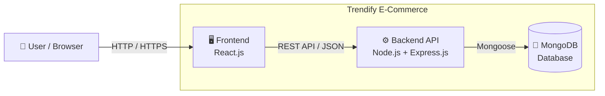
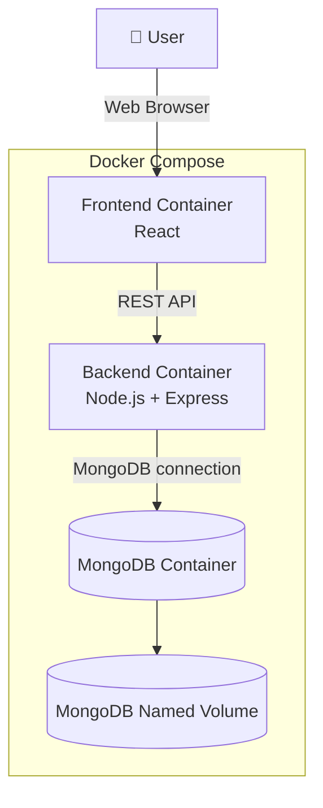
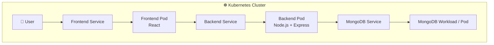
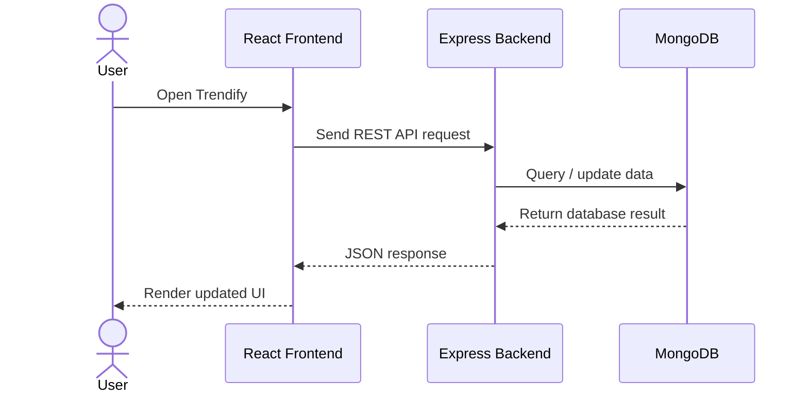
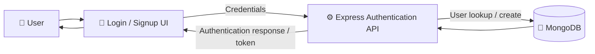
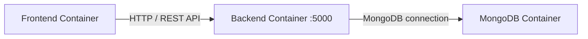
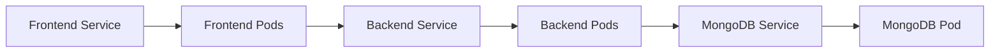
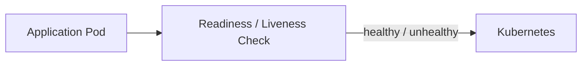
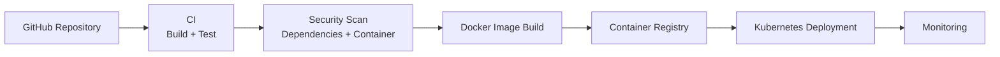
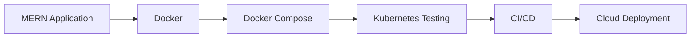

# 🛍️ Trendify E-Commerce

A full-stack e-commerce application built with the **MERN stack**, containerized with **Docker**, and supported by **Kubernetes manifests for deployment testing**.

Trendify separates the frontend, backend API, and MongoDB database into independent components so the application can be developed locally, run with Docker Compose, and tested in a Kubernetes environment.

**GitHub Repository:** https://github.com/onkarghugare08/trendify-ecommerce

---

## 📌 Project Overview

Trendify is a practical e-commerce project built to combine **application development with DevOps practices**.

The application consists of:

- **React.js** frontend for the user interface
- **Node.js + Express.js** backend for REST APIs
- **MongoDB** for persistent application data
- **Docker** for containerization
- **Docker Compose** for multi-container local deployment
- **Kubernetes (`k8s/`)** for container orchestration and deployment testing

The project demonstrates how the same application can move from a traditional local development environment to a containerized and Kubernetes-based setup.

---

## ✨ Features

- 🛍️ Product browsing and e-commerce workflow
- 👤 User-related functionality and authentication APIs
- 🌐 REST API based frontend/backend communication
- 🗄️ MongoDB database integration
- 🔐 Environment-based configuration
- 🐳 Dockerized application services
- 🔗 Docker Compose orchestration
- 💾 Persistent MongoDB storage
- ☸️ Kubernetes deployment/testing manifests
- 📦 Modular frontend and backend structure

> Keep the feature list synchronized with the actual application modules as the project evolves.

---

## 🧰 Technology Stack

| Layer | Technology |
|---|---|
| Frontend | React.js |
| Backend | Node.js |
| API Framework | Express.js |
| Database | MongoDB |
| ODM | Mongoose |
| Authentication | Project-configured authentication/JWT |
| Containerization | Docker |
| Local Orchestration | Docker Compose |
| Container Orchestration | Kubernetes |
| Version Control | Git & GitHub |

---

# 🏗️ Application Architecture

The core Trendify application follows a three-tier architecture.



### 🔄 Request Flow

1. The user interacts with the React frontend.
2. The frontend sends HTTP requests to the Express backend.
3. The backend processes the request and applies application logic.
4. Mongoose is used to communicate with MongoDB.
5. MongoDB returns the requested data or operation result.
6. The backend returns a JSON response to the frontend.
7. The frontend updates the user interface.

---

# 🐳 Docker Architecture

Docker packages the application components into isolated services.



### Docker benefits in this project

- Consistent development environment
- Isolated services
- Easier application startup
- Simple service-to-service networking
- Persistent database storage
- Easier deployment to cloud servers
- Foundation for CI/CD and Kubernetes

---

# ☸️ Kubernetes Architecture

The repository contains a **`k8s/` directory that is used for Kubernetes testing and deployment**.

Kubernetes provides orchestration for the application components and allows the containerized application to be deployed as workloads and exposed through Services.



### Kubernetes flow

```text
User
  ↓
Frontend Service
  ↓
Frontend Pod
  ↓
Backend Service
  ↓
Backend Pod
  ↓
MongoDB Service
  ↓
MongoDB Workload
```

### Why Kubernetes is included

Kubernetes is not just a future idea for this repository. The **`k8s/` folder contains the manifests you are testing**, so the project demonstrates both:

- **Docker Compose** for local multi-container deployment
- **Kubernetes** for container orchestration and deployment testing

---

# 🔁 End-to-End Request Flow



---

# 🔐 Authentication Flow



Sensitive values such as database credentials and authentication secrets should be stored in environment variables and should never be committed to GitHub.

---

# 📂 Project Structure

```text
trendify-ecommerce/
│
├── frontend/                  # React frontend
│   ├── src/
│   ├── public/
│   ├── package.json
│   └── Dockerfile
│
├── backend/                   # Node.js + Express backend
│   ├── Model/
│   ├── Routes/
│   ├── middleware/            # If used by the project
│   ├── controllers/           # If used by the project
│   ├── package.json
│   └── Dockerfile
│
├── k8s/                       # Kubernetes manifests
│   └── *.yaml
│
├── docker-compose.yml         # Multi-container deployment
├── .env.example               # Example environment configuration
└── README.md
```

> The exact YAML filenames under `k8s/` should remain synchronized with the repository.

---

# ⚙️ Environment Variables

Use environment variables for values that change between environments.

### Backend example

```env
PORT=5000
MONGO_URI=mongodb://mongodb:27017/trendify
JWT_SECRET=your_secure_secret
```

When the backend runs inside Docker Compose, MongoDB should normally be referenced using the **MongoDB Compose service name** rather than `localhost`.

Example:

```env
MONGO_URI=mongodb://mongodb:27017/trendify
```

---

# 🚀 Run Locally Without Docker

## 1. Clone the repository

```bash
git clone https://github.com/onkarghugare08/trendify-ecommerce.git
cd trendify-ecommerce
```

## 2. Install backend dependencies

```bash
cd backend
npm install
```

## 3. Install frontend dependencies

Open another terminal:

```bash
cd frontend
npm install
```

## 4. Configure environment variables

Create the required `.env` files using the variables expected by the application.

## 5. Start the backend

```bash
npm run dev
```

## 6. Start the frontend

```bash
npm run dev
```

Open the frontend URL shown by the development server.

---

# 🐳 Run With Docker Compose

From the project root:

```bash
docker compose up --build
```

Run in detached mode:

```bash
docker compose up -d --build
```

Check running services:

```bash
docker compose ps
```

View logs:

```bash
docker compose logs -f
```

Stop the application:

```bash
docker compose down
```

Remove containers and the persistent database volume:

```bash
docker compose down -v
```

> Use `docker compose down -v` only when you intentionally want to delete the MongoDB data stored in the Compose volume.

---

# ☸️ Run the Kubernetes Test Deployment

Make sure a Kubernetes cluster is available, such as **Minikube, Kind, Docker Desktop Kubernetes, or another development cluster**.

Check cluster access:

```bash
kubectl cluster-info
```

Check nodes:

```bash
kubectl get nodes
```

## Apply the Kubernetes manifests

```bash
kubectl apply -f k8s/
```

## Check deployments

```bash
kubectl get deployments
```

## Check pods

```bash
kubectl get pods
```

## Check services

```bash
kubectl get services
```

## View pod logs

```bash
kubectl logs <pod-name>
```

## Inspect a resource

```bash
kubectl describe pod <pod-name>
```

## Delete the Kubernetes test deployment

```bash
kubectl delete -f k8s/
```

---

# 🔌 Service Communication

## Docker Compose



## Kubernetes



The important Kubernetes concept is that application components communicate through **Services** rather than relying on individual Pod IP addresses.

---

# 🩺 Health & Reliability

Health checks help determine whether an application is ready to serve traffic.

A typical Kubernetes flow is:



> Document the exact health endpoint from the backend implementation here when it is finalized.

---

# 🔒 Security Practices

- Never commit `.env` files containing secrets.
- Use strong authentication secrets.
- Validate API input.
- Restrict CORS origins in production.
- Use HTTPS in production.
- Keep dependencies and base images updated.
- Avoid exposing MongoDB directly to the public internet.
- Use least-privilege credentials for production deployments.
- Scan container images for known vulnerabilities before production deployment.

---

# 🔄 DevOps / CI-CD Roadmap

The project already demonstrates **containerization and Kubernetes testing**. A natural next stage is automated CI/CD.



Possible improvements include:

- GitHub Actions CI/CD
- Docker image publishing
- Trivy container scanning
- Automated Kubernetes deployment
- AWS deployment
- Nginx reverse proxy
- HTTPS/TLS
- Monitoring and centralized logging

---

# 📈 Project Evolution



This progression reflects the DevOps journey of the project:

**Application Development → Containerization → Orchestration → Automation → Cloud Deployment**

---

# 💡 Key Learning Outcomes

Through this project, the following skills are demonstrated:

- Full-stack MERN development
- REST API integration
- MongoDB and Mongoose
- Environment-based configuration
- Dockerfile creation
- Docker container networking
- Docker Compose
- Persistent database storage
- Kubernetes manifests
- Kubernetes Deployments and Services
- Container orchestration concepts
- Git and GitHub workflow
- DevOps-oriented application architecture

---

# 🧑‍💻 Author

**Onkar Ghugare**

GitHub: [@onkarghugare08](https://github.com/onkarghugare08)

Project: [Trendify E-Commerce](https://github.com/onkarghugare08/trendify-ecommerce)

---

# ⭐ Support

If you find this project useful, please consider giving the repository a ⭐ on GitHub.

---

# 📄 License

Add the project's actual license here once a `LICENSE` file is committed.
