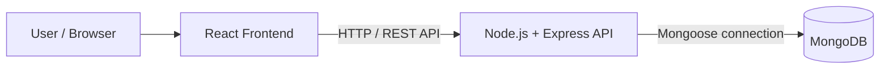
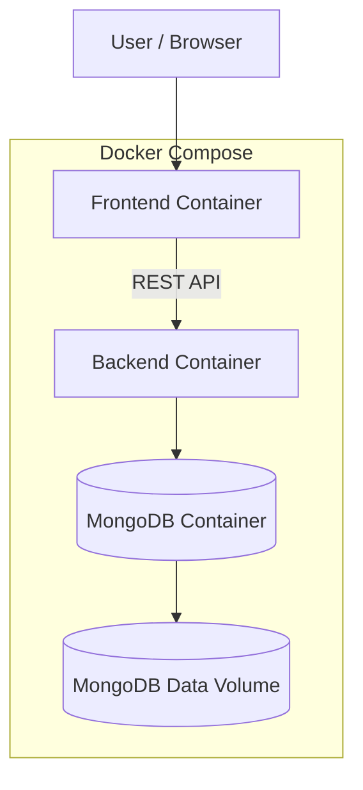
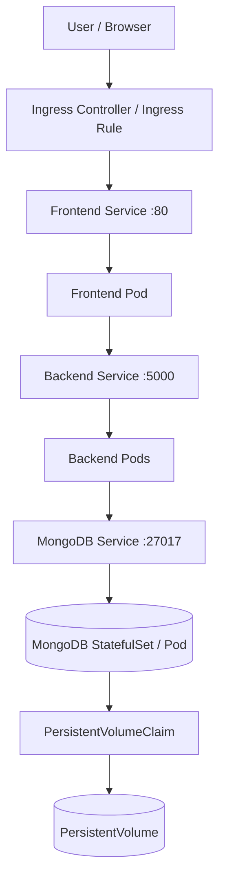
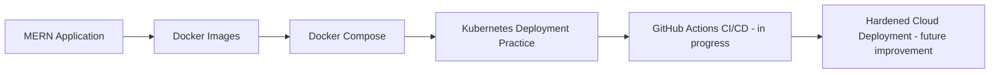

# 🛍️ Trendify E-Commerce

A full-stack **MERN e-commerce application** that has evolved from an application-development project into a hands-on **DevOps and Kubernetes assignment**. The repository includes Docker and Docker Compose configuration alongside Kubernetes manifests used to deploy and test the application.

**Repository:** https://github.com/onkarghugare08/trendify-ecommerce

> **Project status:** The MERN application, Docker setup, and Kubernetes test deployment are documented here. GitHub Actions automation for creating a Kind cluster is still incomplete and is called out below rather than being presented as working.

---

## 📌 Project Overview

Trendify separates the user interface, API, and database into components that can be developed and run together. The project is also used to practise containerization, workload orchestration, persistent storage, service discovery, resource management, access control, and scheduled operations in Kubernetes.

### Main components

- **Frontend:** React.js application
- **Backend:** Node.js and Express.js REST API
- **Database:** MongoDB, accessed by the backend through Mongoose
- **Containerization:** Docker
- **Local multi-container setup:** Docker Compose
- **Orchestration and deployment practice:** Kubernetes manifests in `k8s/`

## ✨ Highlights

- MERN application organized into frontend and backend components
- REST API communication between the frontend and backend
- MongoDB integration and persistent database storage
- Dockerfiles and Docker Compose configuration
- Kubernetes Deployments, Services, and namespace isolation
- ConfigMaps and Secrets for configuration
- Container CPU and memory requests and limits
- Readiness and liveness probes
- PersistentVolume and PersistentVolumeClaim for MongoDB data
- Ingress configuration for HTTP routing
- Horizontal Pod Autoscaler (HPA)
- Role-Based Access Control (RBAC) and a dedicated ServiceAccount
- MongoDB backup CronJob manifest
- Rolling-update and rollback practice

---

## 🧰 Technology Stack

| Area | Technology |
|---|---|
| Frontend | React.js |
| Backend runtime | Node.js |
| API framework | Express.js |
| Database | MongoDB |
| ODM | Mongoose |
| Containerization | Docker |
| Local orchestration | Docker Compose |
| Container orchestration | Kubernetes |
| Local Kubernetes cluster used for the assignment | Kind |
| Version control | Git and GitHub |

---

## 🏗️ Application Architecture

The application follows a three-tier structure: presentation, API/business logic, and data storage.



### Request flow

1. A user opens and interacts with the React frontend.
2. The frontend sends requests to the backend API.
3. Express handles the request and runs the relevant application logic.
4. The backend reads or writes data in MongoDB through Mongoose.
5. The API returns a response to the frontend, which updates the interface.

---

## 🐳 Docker and Docker Compose

Docker packages the application components into containers. Docker Compose coordinates the frontend, backend, and database for local multi-container development.



### Start with Docker Compose

Run these commands from the repository root:

```bash
docker compose up --build
```

Run in the background:

```bash
docker compose up -d --build
```

Inspect containers and logs:

```bash
docker compose ps
docker compose logs -f
```

Stop the stack:

```bash
docker compose down
```

> `docker compose down -v` also removes Compose-managed volumes. Use it only when you intentionally want to delete the database data stored in those volumes.

---

## ☸️ Kubernetes Assignment

The `k8s/` directory contains the Kubernetes resources used to practise deploying Trendify and operating it inside a cluster. The cluster used for the reported audit had three Kind nodes named `audit-control-plane`, `audit-worker`, and `audit-worker2`.

### Kubernetes architecture



### Kubernetes manifests

| File | Purpose |
|---|---|
| `k8s/01-namespace.yml` | Creates the `trendify` namespace |
| `k8s/02-frontend-deployment.yml` | Frontend Deployment |
| `k8s/03-frontend-service.yml` | Frontend Service |
| `k8s/04-backend-deployment.yml` | Backend Deployment |
| `k8s/05-secrets.yml` | Kubernetes Secret for sensitive configuration |
| `k8s/06-configmap.yml` | Non-sensitive application configuration |
| `k8s/07-mongodb.yml` | MongoDB StatefulSet/workload |
| `k8s/08-mongodb-service.yml` | MongoDB Service |
| `k8s/09-mongo_pv.yml` | Persistent storage resource for MongoDB |
| `k8s/10-backend-service.yml` | Backend Service |
| `k8s/11-hpa.yml` | Horizontal Pod Autoscaler |
| `k8s/12-ingress.yml` | Ingress routing configuration |
| `k8s/13-rbac.yml` | ServiceAccount, Role, and RoleBinding resources |
| `k8s/14-backup-cronjob.yml` | Scheduled MongoDB backup job definition |

### Deploy to a Kubernetes cluster

**Prerequisites:** Docker, `kubectl`, access to a working Kubernetes cluster, and the application images referenced by the manifests available to that cluster. If using Kind, build/load your images into the correct cluster; if using a remote cluster, publish images to a registry the cluster can access.

Check cluster access and nodes:

```bash
kubectl cluster-info
kubectl get nodes
```

Apply the manifests from the project root:

```bash
kubectl apply -f k8s/
```

Inspect the Trendify resources:

```bash
kubectl get all -n trendify
kubectl get ingress,pvc,hpa,cronjob -n trendify
kubectl get pv
```

Inspect pod logs and events:

```bash
kubectl logs -n trendify <pod-name>
kubectl describe pod -n trendify <pod-name>
kubectl get events -n trendify --sort-by=.metadata.creationTimestamp
```

Delete the resources declared in the manifests when you intentionally want to remove the test deployment:

```bash
kubectl delete -f k8s/
```

> **Ingress / EC2 access note:** The audit output showed the Ingress host as `trendify.localtest.me` and its address as `localhost`. This is not proof that the application is publicly reachable through the EC2 public IP. To access it remotely, configure the Ingress controller, Kind port mappings or the cluster networking, the EC2 security group, and a hostname that resolves to the intended endpoint. Verify the URL from another machine before documenting it as a public demo.

---

## ✅ Kubernetes Audit Results

The last reported run of `./audit.sh trendify` returned **15/16 checks**: all **12/12 must-have checks** and **3/4 stretch checks** passed. This is the result from that audit run, not a guarantee that every new cluster or machine will produce the same state.

| Audit area | Result | Evidence / note |
|---|---|---|
| Deployment and ReplicaSet | ✅ | Audit detected application Deployments and ReplicaSets |
| Services, namespace, labels, and selectors | ✅ | Audit found three Services with matching Pod endpoints |
| Rolling update / rollback practice | ✅ | Audit detected a Deployment rolled to a new image; keep rollout-history and rollback command output as submission evidence |
| ConfigMap and Secret | ✅ | Audit detected one non-default ConfigMap and one Opaque Secret |
| Resource requests and limits | ✅ | Audit reported CPU and memory requests/limits on all 4 containers |
| Liveness and readiness probes | ✅ | Audit reported both probes on all 4 containers |
| PersistentVolumeClaim | ✅ | Audit reported one bound PVC |
| Ingress | ✅ | Audit detected one Ingress and one running controller Pod; external EC2 reachability still needs a separate test |
| Multi-node cluster | ✅ | Audit detected three nodes |
| HPA | ✅ | Audit detected one HPA |
| RBAC and ServiceAccount | ✅ | Audit detected Role/RoleBinding resources and a custom ServiceAccount |
| MongoDB backup CronJob | ✅ | Audit detected one CronJob |
| GitHub Actions to Kind | ❌ | Workflow is not currently passing the audit's check for Kind cluster creation; this remains work in progress |

### Snapshot of resources from the reported run

The output shared for the `trendify` namespace showed:

- Frontend Deployment: 1 replica running
- Backend Deployment: 2 replicas running
- MongoDB StatefulSet: 1 Pod running
- Services: `frontend` on port 80, `backend` on port 5000, and `mongodb` on port 27017
- MongoDB PVC: `mongodata-mongodb-0`, reported `Bound`, with 1 GiB requested
- HPA: target range of 1–5 frontend replicas; the reported snapshot showed CPU and memory utilization below the configured targets
- Backup CronJob: schedule `0 2 * * *` (02:00 according to the cluster's scheduling timezone/configuration)
- Ingress host: `trendify.localtest.me`; reported address `localhost`

These are a snapshot of the environment at audit time. Check the live cluster to confirm current status.

### RBAC verification

The reported authorization test returned `yes` for listing Pods and `no` for deleting Pods as the `trendify-viewer` ServiceAccount. This illustrates the intended least-privilege behavior for that test:

```bash
kubectl auth can-i list pods -n trendify \
  --as=system:serviceaccount:trendify:trendify-viewer

kubectl auth can-i delete pods -n trendify \
  --as=system:serviceaccount:trendify:trendify-viewer
```

### GitHub Actions status

GitHub Actions automation that creates a Kind cluster and deploys/tests the project is **not yet passing the audit**. The audit reported that it could not find the expected Kind-cluster workflow setup under `.github/workflows`. Do not treat the pipeline as complete until the workflow exists, runs successfully, and its run is saved as evidence.

---

## 🔐 Configuration and Security Notes

- Keep `.env` files and real credentials out of Git. Commit an example file with placeholder values instead.
- Use Kubernetes Secrets for sensitive values, but remember that Secrets are not a substitute for appropriate cluster access control or encryption configuration.
- Use ConfigMaps for non-sensitive settings.
- Do not expose MongoDB directly to the public internet.
- Restrict CORS to the required origins in production.
- Use HTTPS/TLS for a public deployment.
- Keep dependencies and base images updated.
- Use least-privilege ServiceAccounts and RBAC permissions.
- Add dependency and container-image scanning to CI before production deployment.

### Environment variables

The exact variables depend on the application and manifests. A typical backend configuration may resemble the following; use the variable names expected by the code and never replace production credentials with these placeholders:

```env
PORT=5000
MONGO_URI=mongodb://mongodb:27017/trendify
JWT_SECRET=replace_with_a_secure_secret
```

When running in Docker Compose or Kubernetes, the database hostname should normally be the database service name rather than `localhost`.

---

## 🔄 DevOps Project Evolution



The project journey is **Application Development → Containerization → Orchestration → Automation → Cloud Operations**. The CI/CD stage is in progress; it is not being represented as complete yet.

## 🎯 Key Learning Outcomes

This project has provided practice with:

- MERN application architecture and REST API communication
- Dockerfiles, image builds, container networking, and Docker Compose
- Kubernetes Namespaces, Deployments, ReplicaSets, and Services
- ConfigMaps, Secrets, and environment-specific configuration
- Resource requests/limits and liveness/readiness probes
- MongoDB persistence using PV/PVC resources
- Ingress routing and cluster networking considerations
- HPA, RBAC, ServiceAccounts, and scheduled CronJobs
- Rolling updates, rollback workflow, and evidence-based auditing
- Identifying unfinished CI/CD automation and reporting its current status accurately

---

## 👨‍💻 Author

**Onkar Ghugare**

- GitHub: [@onkarghugare08](https://github.com/onkarghugare08)
- Project repository: [Trendify E-Commerce](https://github.com/onkarghugare08/trendify-ecommerce)

---
